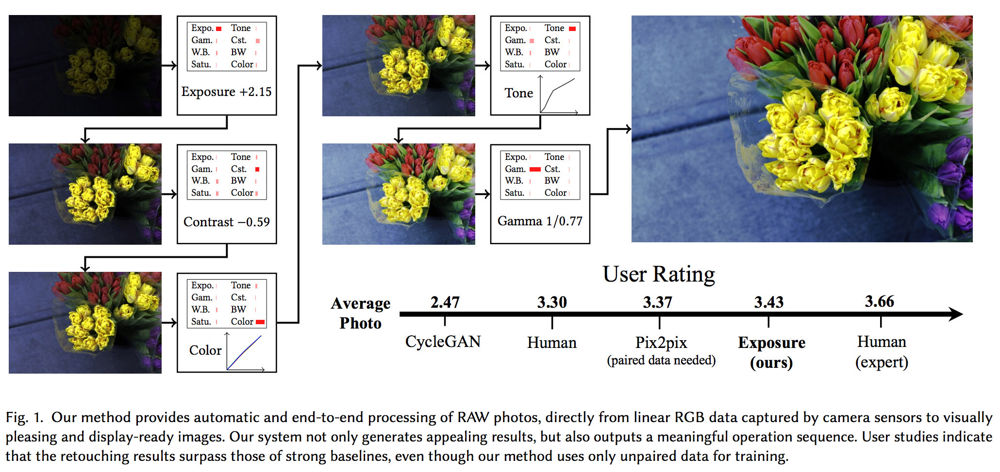
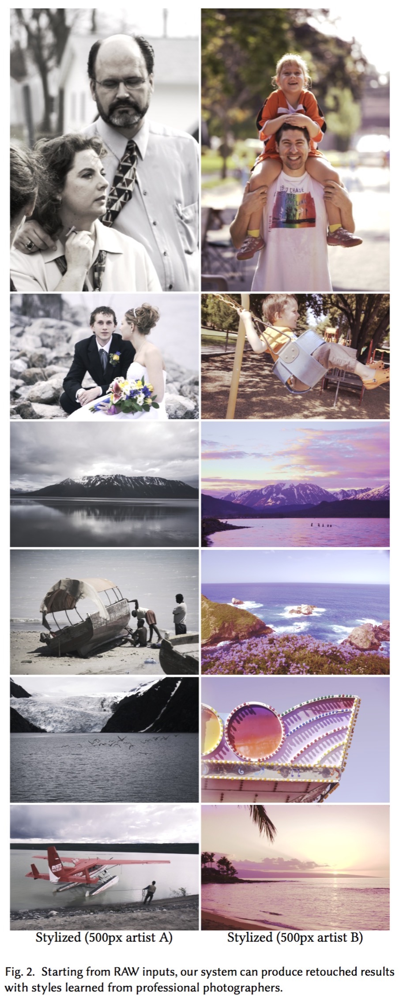
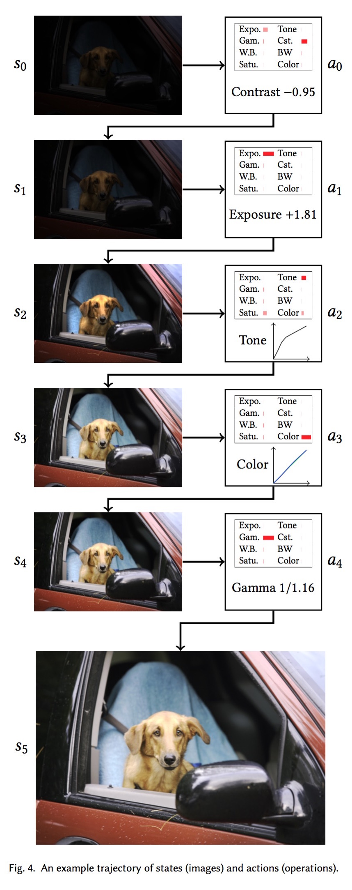
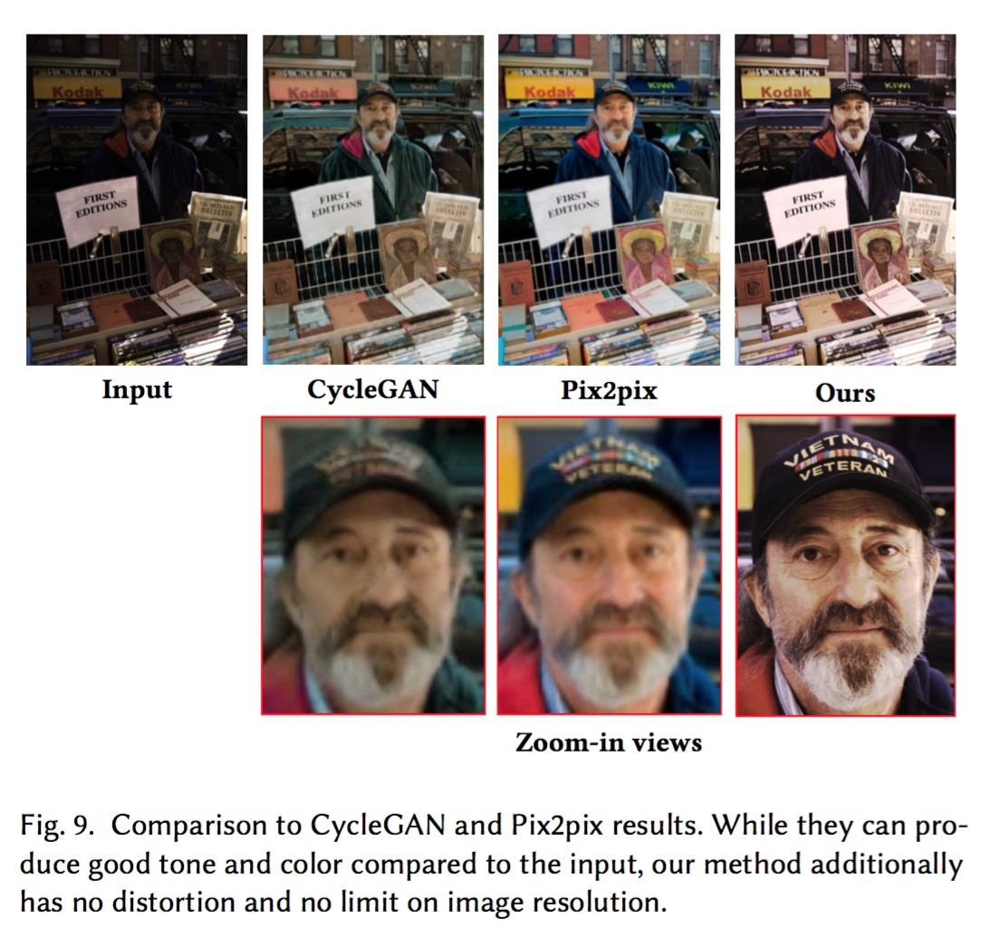
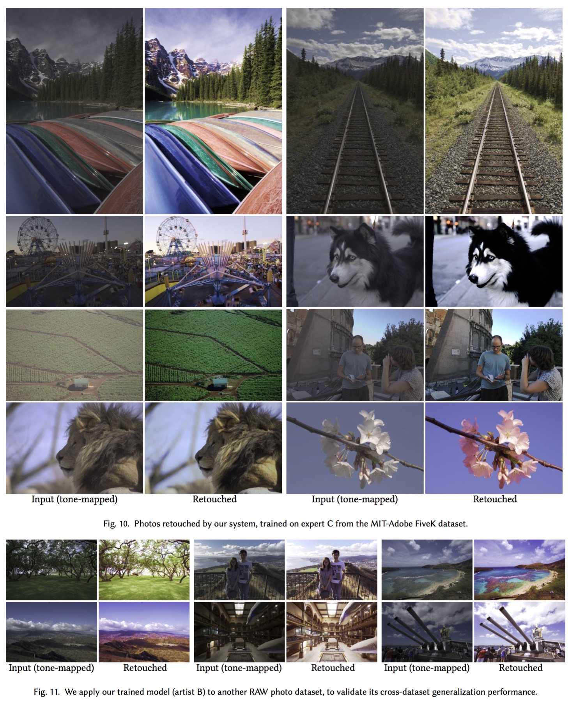
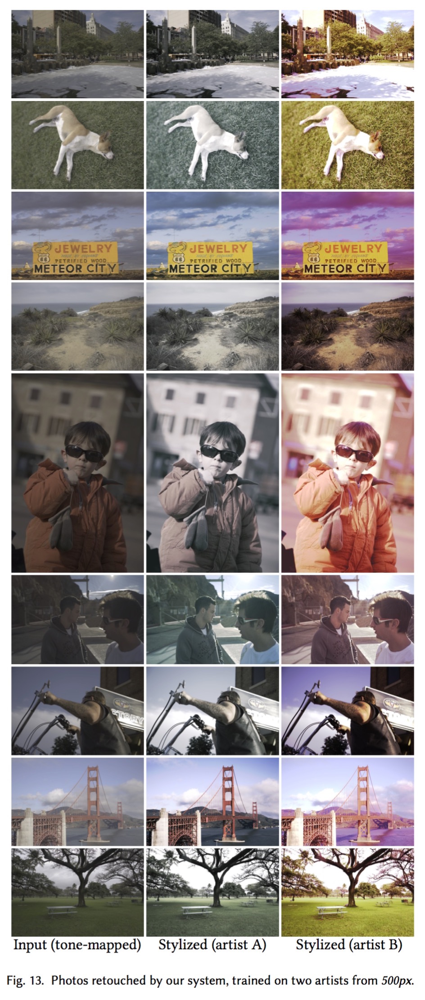
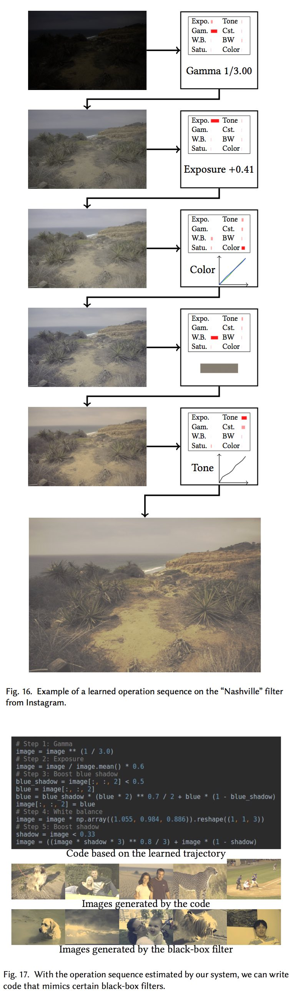

# Exposure:<br>A White-Box Photo Post-Processing Framework
#### ACM Transactions on Graphics (presented at SIGGRAPH 2018)
[Yuanming Hu](http://taichi.graphics/me/)<sup>1,2</sup>, [Hao He](https://github.com/hehaodele)<sup>1,2</sup>, Chenxi Xu<sup>1,3</sup>, [Baoyuan Wang](https://sites.google.com/site/zjuwby/)<sup>1</sup>, [Stephen Lin](https://www.microsoft.com/en-us/research/people/stevelin/)<sup>1</sup>

#### [[Paper](https://arxiv.org/abs/1709.09602)] [[PDF Slides](https://github.com/yuanming-hu/exposure/releases/download/slides/exposure-slides.pdf)] [[PDF Slides with notes](https://github.com/yuanming-hu/exposure/releases/download/slides/exposure-slides-with-notes.pdf)] [[SIGGRAPH 2018 Fast Forward](https://www.youtube.com/watch?v=JdTkKhm0LVU)]

<sup>1</sup>Microsoft Research <sup>2</sup>MIT CSAIL <sup>3</sup>Peking University

**Change log:**
 - July 9, 2018: Minor improvements. 
 - May 20, 2018: Inlcuded user study UI. 
 - May 13, 2018: Minor improvements. 
 - March 30, 2018: Added instructions for preparing training data with Adobe Lightroom.
 - March 26, 2018: Updated MIT-Adobe FiveK data set and treatments for 8-bit `jpg` and `png` images.
 - March 9, 2018: Finished code clean-up. Uploaded code and some instructions.
 - March 1, 2018: Added some images. 




# Installation
Requirements: `python3` and `tensorflow`. Tested on Ubuntu 16.04 and Arch Linux. OS X may also work, though not tested. 
```
sudo pip3 install tensorflow-gpu opencv-python tifffile scikit-image
git clone https://github.com/yuanming-hu/exposure --recursive
cd exposure
```
<!-- Make sure you have `pdflatex`, if you want to generate the steps. -->

# Using the pretrained model
 - `python3 evaluate.py example pretrained models/sample_inputs/*.tif`
 - Results will be generated at `outputs/`

# Training your own model on the FiveK dataset 
  - `python3 fetch_fivek.py`
    - This script will automatically setup the [`MIT-Adobe FiveK Dataset`](https://data.csail.mit.edu/graphics/fivek/)
    - Total download size: ~2.4GB
    - Only the downsampled and data-augmented image pack will be downloaded. Original dataset is large as 50GB and needs Adobe Lightroom to pre-process the RAW files. If you want to do data pre-processing and augmentation on your own, please follow the instructions [here](https://github.com/yuanming-hu/exposure/wiki/Preparing-data-for-the-MIT-Adobe-FiveK-Dataset-with-Lightroom).
  - `python3 train.py example test`
    - This command will load `config_example.py`,
    - and create a model folder at `models/example/test`
  - Have a cup of tea and wait for the model to be trained (~100 min on a GTX 1080 Ti)
    - The training progress is visualized at folder `models/example/test/images-example-test/*.png`
    - **Legend**: top row: learned operating sequences; bottom row: replay buffer, result output samples, target output samples
  - `python3 evaluate.py example test models/sample_inputs/*.tif` (This will load `models/example/test`)
  - Results will be generated at `outputs/`

# Training on your own dataset
Please check out https://github.com/yuanming-hu/exposure/blob/master/config_sintel.py

# Visual Results

 





All results on the MIT-FiveK data set: https://github.com/yuanming-hu/exposure_models/releases/download/v0.0.1/test_outputs.zip

# FAQ
1) **Does it work on `jpg` or `png` images?**

To some extent, yes. `Exposure` is originally designed for RAW photos, which assumes 12+ bit color depth and linear "RGB" color space (or whatever we get after demosaicing). `jpg` and `png` images typically have only 8-bit color depth (except 16-bit `png`s) and the lack of information (dynamic range/activation resolution) may lead to suboptimal results such as posterization. Moreover, `jpg` and most `png`s assume an `sRGB` color space, which contains a roughly `1/2.2` Gamma correction, making the data distribution different from training images (which are linear).

Therefore, when applying `Exposure` to these images, such nonlinearity may affect the result, as the pretrained model is trained on linearized color space from `ProPhotoRGB`.
  
If you train `Exposure` in your own collection of images that are `jpg`, it is OK to apply `Exposure` to similar `jpg` images, though you may still get some posterization.

Note that `Exposure` is just a prototype (proof-of-concept) of our latest research, and there are definitely a lot of engineering efforts required to make it suitable for a real product. Like many deep learning systems, usually when the inputs are too different from training data, suboptimal results will be generated. Defects like this may be alleviated by more human engineering efforts which are not included in this research project whose goal is simply prototyping.

2) **The images from the datasets are 16-bit. Have you tried 8bit jpg as input? If so, how about the performance?**
I did. We have some internal projects (which I cannot disclose right now, sorry) that actually have only 8-bit inputs. Most results are as good as 16-bit inputs. However, from time to time (< 5% on the dataset I tested) you may find posterization/saturation artifacts due to the lack of color depth (intensity resolution/dynamic range).

3) **Why am I getting different results everytime I run Exposure on the same image?**

In the paper, you will find that the system is learning a one-to-many mapping, instead of one-to-one.
The one-to-many mapping mechanism is achieved using (random) dropout (instead of noise vectors in some other GAN papers), and therefore you may get slightly different results every time.


